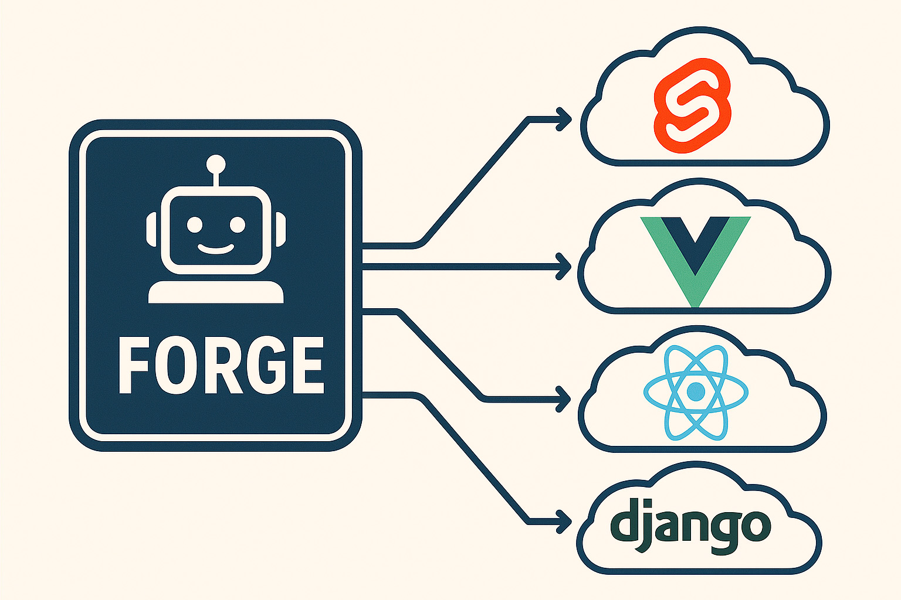

# Forge

A lightweight, autonomous agent built using uAgents to facilitate intelligent project scaffolding/initialisation and automation.

[](https://github.com/fetch-ai/uAgents)
[](https://www.python.org/downloads/)
[](https://reactjs.org/)
[](https://www.djangoproject.com/)
[](https://svelte.dev/)
[](https://preactjs.com/)
[](https://lit.dev/)
[](https://www.solidjs.com/)
[](https://qwik.builder.io/)
[](https://vuejs.org/)



## 🚀 Features

- 🤖 Natural language project creation
- 🎯 Supports multiple projects:
  - Django
  - React
  - Svelte
  - Preact
  - Vanilla JS/TS
  - Lit
  - Solid
  - Qwik
  - Vue.js
- ⚙️ Smart configuration handling
- 📦 Automated dependency management
- 🔄 Best practices templates

## Development Setup

### Agent

Install dependencies

```bash
cd agent
pipenv install
```

Run agent

```bash
pipenv run python -m src.agent
```

### UI

Install dependencies

```bash
cd ui
npm install
```

Run dev server

```bash
npm run dev
```

## 🌐 Architecture


## 📝 Example Usage

```bash
# Chat with Forge
"Create a new Django project named chapy"
"Scaffold a React app with TypeScript and SWC"
"Initialize a Vue.js project"
```
