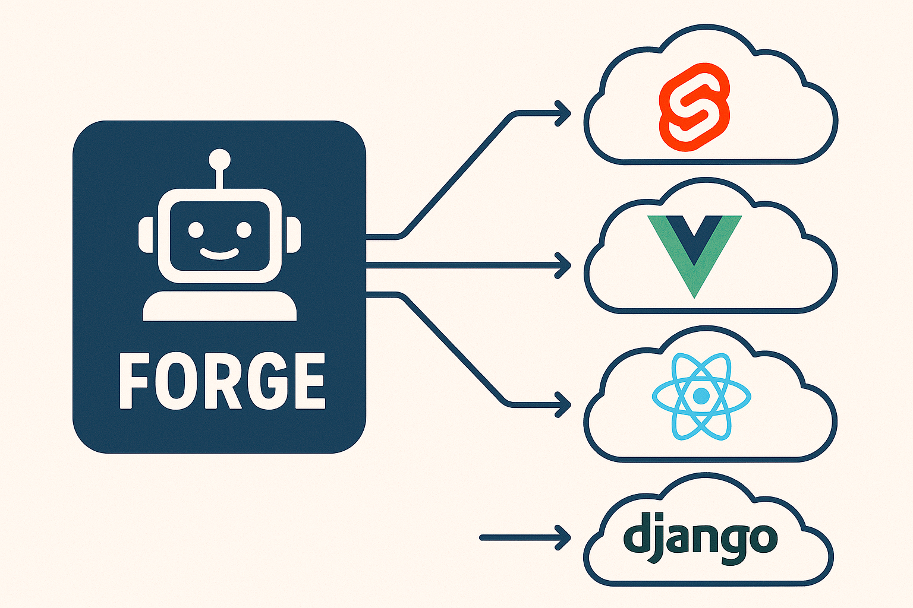
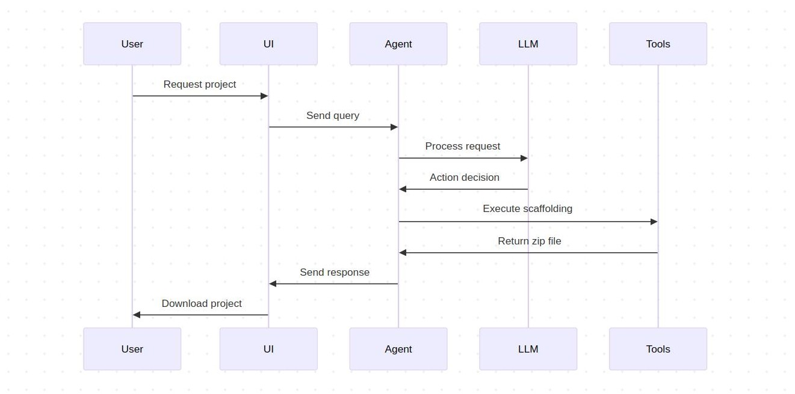

# uAgents Hack

A lightweight, autonomous agent built using uAgents to facilitate intelligent project scaffolding/initialisation and automation.

[](https://github.com/fetch-ai/uAgents)
[](https://www.python.org/downloads/)
[](https://reactjs.org/)



## 🚀 Features

- 🤖 Natural language project creation
- 🎯 Supports multiple frameworks:
  - Django
  - React (Vite/CRA)
  - Vue.js
- ⚙️ Smart configuration handling
- 📦 Automated dependency management
- 🔄 Best practices templates

## Development Setup

### uAgents

Install dependencies

```bash
cd agent
pipenv install
```

Run agent

```bash
pipenv run python -m src.agent
```

### UI

Install dependencies

```bash
cd ui
npm install
```

Run dev server

```bash
npm run dev
```

## 🌐 Architecture



## 📝 Example Usage

```bash
# Chat with Forge
"Create a new Django project named chapy"
"Scaffold a React app with TypeScript and SWC"
"Initialize a Vue.js project"
```
