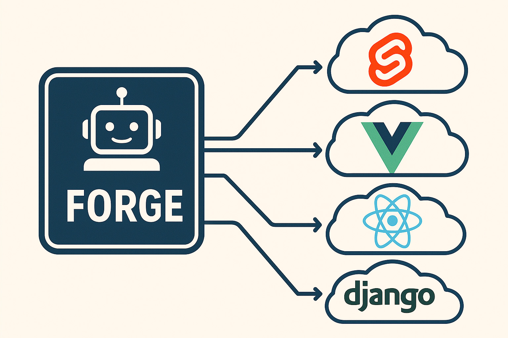
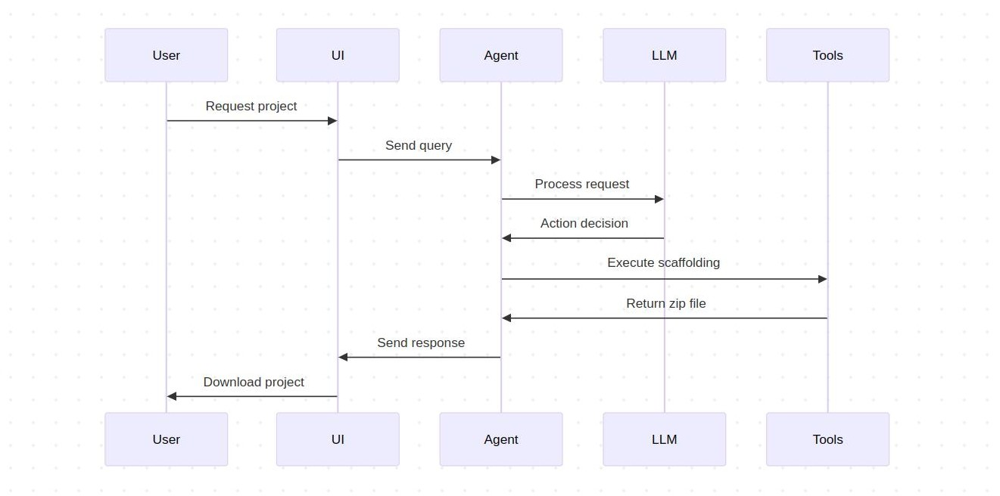

# Forge

A lightweight, autonomous agent built using uAgents to facilitate intelligent project scaffolding/initialisation and automation.

[](https://innovationlab.fetch.ai/)

[![Live](https://img.shields.io/badge/Live-8A2BE2?style=flat&logo=data%3Aimage%2Fsvg%2Bxml%3Bbase64%2CPHN2ZyB3aWR0aD0iMTAiIGhlaWdodD0iOCIgdmlld0JveD0iMCAwIDEwIDgiIGZpbGw9Im5vbmUiIHhtbG5zPSJodHRwOi8vd3d3LnczLm9yZy8yMDAwL3N2ZyI%2BCjxwYXRoIGQ9Ik0yLjI1IDcuNUMxIDcuNSAwIDYuNSAwIDUuMjVDMCA0LjI4MTI1IDAuNjI1IDMuNDM3NSAxLjUgMy4xNDA2MkMxLjUgMy4wOTM3NSAxLjUgMy4wNDY4OCAxLjUgM0MxLjUgMS42MjUgMi42MDkzOCAwLjUgNCAwLjVDNC45MjE4OCAwLjUgNS43MzQzOCAxLjAxNTYyIDYuMTU2MjUgMS43NjU2MkM2LjM5MDYyIDEuNTkzNzUgNi42ODc1IDEuNSA3IDEuNUM3LjgyODEyIDEuNSA4LjUgMi4xNzE4OCA4LjUgM0M4LjUgMy4yMDMxMiA4LjQ1MzEyIDMuMzc1IDguMzkwNjIgMy41NDY4OEM5LjMxMjUgMy43MzQzOCAxMCA0LjU0Njg4IDEwIDUuNUMxMCA2LjYwOTM4IDkuMDkzNzUgNy41IDggNy41SDIuMjVaTTYuNzY1NjIgMy43NjU2MkM2LjkwNjI1IDMuNjI1IDYuOTA2MjUgMy4zOTA2MiA2Ljc2NTYyIDMuMjVDNi42MDkzOCAzLjA5Mzc1IDYuMzc1IDMuMDkzNzUgNi4yMzQzOCAzLjI1TDQuNSA0Ljk4NDM4TDMuNzY1NjIgNC4yNUMzLjYwOTM4IDQuMDkzNzUgMy4zNzUgNC4wOTM3NSAzLjIzNDM4IDQuMjVDMy4wNzgxMiA0LjM5MDYyIDMuMDc4MTIgNC42MjUgMy4yMzQzOCA0Ljc2NTYyTDQuMjM0MzggNS43NjU2MkM0LjM3NSA1LjkyMTg4IDQuNjA5MzggNS45MjE4OCA0Ljc2NTYyIDUuNzY1NjJMNi43NjU2MiAzLjc2NTYyWiIgZmlsbD0id2hpdGUiLz4KPC9zdmc%2BCg%3D%3D)](https://forge.daimones.xyz)
[](https://github.com/fetch-ai/uAgents)
[](https://www.python.org/downloads/)
[](https://reactjs.org/)
[](https://www.djangoproject.com/)
[](https://svelte.dev/)
[](https://preactjs.com/)
[](https://lit.dev/)
[](https://www.solidjs.com/)
[](https://qwik.builder.io/)
[](https://vuejs.org/)



## 🚀 Features

- 🤖 Natural language project creation
- 🎯 Supports multiple projects:
  - Django
  - React
  - Svelte
  - Preact
  - Vanilla JS/TS
  - Lit
  - Solid
  - Qwik
  - Vue.js
- ⚙️ Smart configuration handling
- 📦 Automated dependency management
- 🔄 Best practices templates

## Agentverse

- Forge Agent Address: [agent1q255rqw6shtmnwytv4jr2jlcak54s9f25059fpj9st3y4z9ltmywvvvqwgv](https://agentverse.ai/agents/details/agent1q255rqw6shtmnwytv4jr2jlcak54s9f25059fpj9st3y4z9ltmywvvvqwgv)

## Data Models

### Input Data Model

```py
class Request(Model):
    query: str
```

### Output Data Model

```py
class ActionArgs(Model):
    project_name: str
    template: Optional[str] = None
    package_manager: Optional[str] = None


class Data(Model):
    thought: str
    action: Optional[str] = None
    action_args: Optional[ActionArgs] = None
    result: Optional[str] = None
    response: Optional[str] = None


class Response(Model):
    status: str
    message: str
    data: Optional[Data] = None
```

## Development Setup

### Agent

Install dependencies

```bash
cd agent
pipenv install
```

Run Forge

```bash
pipenv run python -m src.forge
```

Run Assistant

```bash
pipenv run python -m src.assistant
```

### UI

Install dependencies

```bash
cd ui
npm install
```

Run dev server

```bash
npm run dev
```

## 🌐 Architecture



## 📝 Example Usage

```bash
# Chat with Forge
"Create a new Django project named chapy"
"Scaffold a React app with TypeScript and SWC"
"Initialize a Vue.js project"
```
